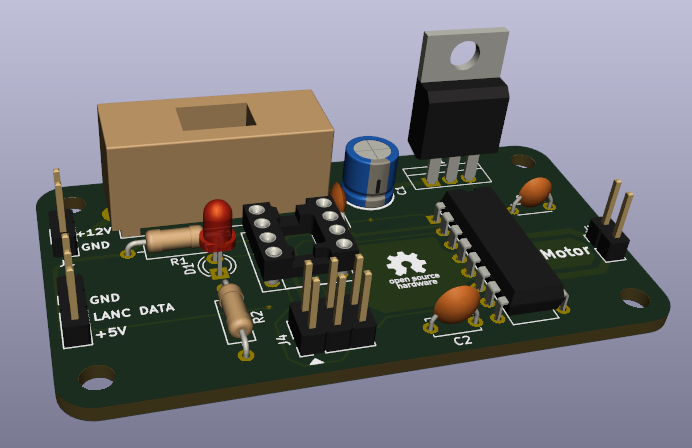

# LANC zoom controller

This project is a circuit board intended to control a DC motor from a
“zoom controller” wired remote conforming to the Sony's LANC protocol.



## Motivation

Many people use DSLRs to record high-quality video despite their
inferior ergonomics relative to conventional camcorders. When mounted on
a tripod, many camcorders can be zoomed in and out using a wired remote
control, commonly known as a “[zoom controller][]”. In contrast, most
DSLRs have non-motorized zooms, and reaching for the zoom ring is
inconvenient when the camera is tripod-mounted.

The purpose of this project is to be able to control the zoom ring of a
DSLR using the same kind of wired remote one would use with a camcorder.
Specifically, this circuit board interfaces with remotes supporting the
widely used Sony's [LANC protocol][], and is capable of driving a
low-power DC motor from a 12&nbsp;V power supply. It is up to the user
to rig a DC motor to the zoom ring of their lens.

[zoom controller]: http://www.google.com/search?q=LANC+zoom+controller
[LANC protocol]: https://en.wikipedia.org/wiki/LANC

## Principle of operation

The main parts of the circuit are an [H bridge][] for driving the DC
motor and an [ATtiny][] microcontroller for driving the H bridge and
handling the communication with the wired remote.

The remote sends commands such as “zoom in at speed #2” or “zoom out at
speed #5”. In response to these commands, the microcontroller sets the
direction of rotation of the motor, and sends a [PWM][] signal to the
“enable” input of the H bridge. The duty cycle of the PWM signal depends
on the speed selected by the remote. This duty cycle in turn controls
the average power received by the DC motor. There is no feedback from
the motor, thus no precise control on its actual rotational speed.

[H bridge]: https://en.wikipedia.org/wiki/H_bridge
[ATtiny]: https://www.microchip.com/wwwproducts/en/ATtiny25
[PWM]: https://en.wikipedia.org/wiki/Pulse-width_modulation

## Building the circuit

Build the PCB according to the layout file
[ctrl-zoom.kicad\_pcb](board/ctrl-zoom.kicad_pcb), which is in the
format of the free [KiCad design software][KiCad]. Many professional PCB
shops can do it for you if you provide the proper design files. Some
accept the KiCad format directly, and need only that file. Others
require the design to be provided as a set of “Gerber” and drill files.
In this case, [install KiCad][KiCad-download], open ctrl-zoom.kicad\_pcb
with KiCad, and let it generate the required files (menu: File →
Plot...).

Get the parts listed below and solder them to the board. All are
through-hole components. Refer to the [schematic](doc/schematic.pdf) and
the labels on the PCB's silkscreen for the correct placement and
orientations.

| designator | quantity | item
|:----------:|:--------:|------------------------------------------------
|   U1       |     1    | L7805 voltage regulator, 5 V, TO-220 package
|   U2       |     1    | ATtiny25-20PU, DIP-8 package [1]
|   U3       |     1    | L293D H-bridge, DIP-16 package
|   C1       |     1    | 100 µF radial electrolytic capacitor, ⌀ 6.3 mm
|   C2       |     1    | 1 µF ceramic capacitor, pin spacing: 5 mm
|   C3, C4   |     2    | 100 nF ceramic capacitor, pin spacing: 5 mm
|   J1, J3   |     2    | 1×2 male pin header, pitch: 2.54 mm
|   J2       |     1    | 1×3 male pin header, pitch: 2.54 mm
|   J4       |     1    | 2×3 male pin header, pitch: 2.54 mm
|   F1       |     1    | 1 A, 5×20 mm fuse + Stelvio-Kontek PTF78 holder
|   D1       |     1    | 3 mm LED
|   R1       |     1    | 10 kΩ resistor
|   R2       |     1    | 470 Ω resistor

[1] Any ATtiny of the same family can be used (25, 25V, 45, 45V, 85, or
85V). It is recommended to use a DIP-8 socket, rather than soldering the
ATtiny directly to the board.

## Building and uploading the firmware

You need GNU make, avr-gcc, avr-libc, avrdude and an ISP programmer. An
Arduino [can be used as an ISP programmer][ArduinoISP]. On Ubuntu Linux,
you can install the required software by typing:

```shell
sudo apt install make gcc-avr avr-libc avrdude
```

Move to the firmware directory, edit the `MCU` and `PROGRAMMER`
variables in the Makefile, then type:

```shell
make
```

For uploading the firmware, connect the programmer to your computer and
the ISP header (J4) on the board, paying attention to the orientation
(pin 1 is bottom left, identified by the white triangle). Then type:

```shell
make upload
```

[KiCad]: http://www.kicad-pcb.org/
[KiCad-download]: http://www.kicad-pcb.org/download/
[ArduinoISP]: https://www.arduino.cc/en/Tutorial/ArduinoISP

## Usage

You will first have to rig a geared DC motor to the zoom ring of your
lens. Then connect the LANC wired remote to the connector on the left
side of the PCB labeled “J2” and the motor to the right-side connector
(J3). The power supply should be connected last, to J1. Actuate the
remote and check that the lens zooms in the desired direction. If this
is not the case, reverse the connection of the motor on J3.

If you are not pleased with the way the motor power varies as a function
of the remote's knob position, you can customize this dependency by
modifying the firmware. Near the top of
[ctrl-zoom.c](firmware/ctrl-zoom.c), locate the lines:

```c++
/* Available motor speeds. */
static __flash const uint8_t speeds[8] = {
    2, 4, 8, 16, 32, 64, 128, 255
};
```

These are the PWM levels corresponding to the 8 speeds that the remote
can request. Change these to your liking, rebuild the firmware and
upload it again (with the supply, the remote and the motor
disconnected).

## License

This project is [open-source hardware][OSH]. All of its files, including
firmware source code, design files and documentation, are provided under
the terms of the MIT licence. See the included [LICENSE](LICENSE) file.

If you use any of this, I would appreciate if you drop me a note. If you
improve on it, you are encouraged to contribute the changes back to the
open-hardware community. These are not, however, legal requirements:
only the terms of the license are legally binding.

[OSH]: https://en.wikipedia.org/wiki/Open-source_hardware
